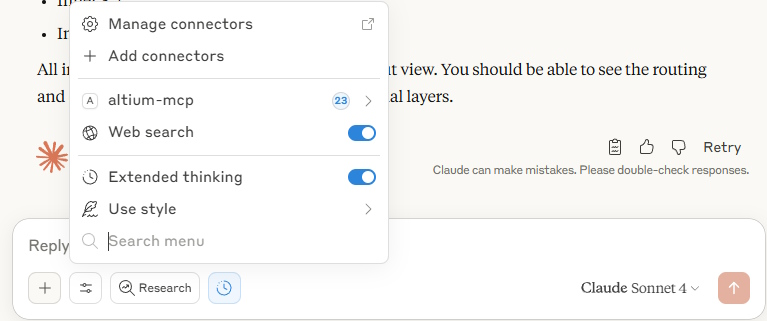
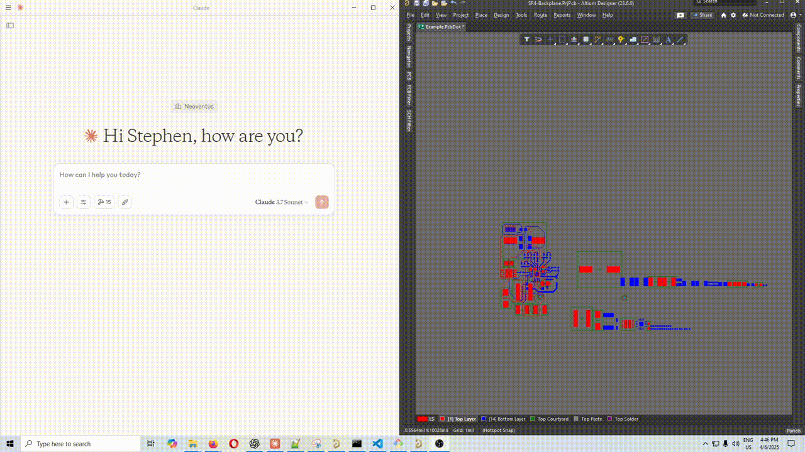

# Altium MCP Server

TLDR: Use Claude to control or ask questions about your Altium project.
This is a Model Context Protocol (MCP) server that provides an interface to interact with Altium Designer through Python. The server allows for querying and manipulation of PCB designs programmatically.

## Example commands
- Run all output jobs
- Create a symbol for the part in the attached datasheet and use the currently open symbol as a reference example.
- Create a schematic symbol from the attached MPM3650 switching regulator datasheet and make sure to strictly follow the symbol placement rules. (Note: Need to open a schematic library. Uses `AppData\Roaming\Claude\Claude Extensions\local.dxt.altium-mcp\server\symbol_placement_rules.txt` description as pin placement rules. Please modify for your own preferences.)
- Create an op-amp symbol with a triangle body like the other op-amps in my library (symbols support line/polygon/arc/ellipse/label body graphics, not just rectangles)
- Find me the LM358 symbol in my opamp library and open it
- Create a multi-part symbol for a quad op-amp from the attached LM324 datasheet (creates parts A, B, C, D with shared V+/V- power pins)
- Create a PCB footprint for the SMD part in the attached datasheet and add it to my open PcbLib
- Duplicate my selected layout. (Will prompt user to now select destination components. Supports Component, Track, Arc, Via, Polygon, & Region)
- Show all my inner layers. Show the top and bottom layer. Turn off solder paste.
- Get me all parts on my design made by Molex
- Give me the description and part number of U4
- Place the selected parts on my pcb with best practices for a switching regulator, then verify clearances and show me a screenshot of the result
- Auto-place my silkscreen, then fix the designators the placer left on top of parts or far from them
- Give me a list of all IC designators in my design
- Get me all length matching rules

## Installing the MCP Server
The easiest way to install is to use Claude Code, point it to this repo and ask it to install it for you. Or alternatively, see below.

[Watch on YouTube](https://youtu.be/HKQMK-hluLs)

1. Make sure Claude has Python 3.10+ installed: `drop down > File > Settings > Extensions > Advanced > Python`. If not, install Python and add it to PATH.
2. Download the `altium-mcp.dxt` desktop extension file from [releases](https://github.com/coffeenmusic/altium-mcp/releases)
3. In Claude Desktop on Windows: `drop down > File > Settings > Extensions > Advanced > Install Extension...` Select the .dxt file

You shouldn't need to restart Claude and you should now see altium-mcp in the tool menu near the search bar.



## Creating a new .dxt (For Developers)

### Bootstrap Venv (Recommended)

This approach ships a small bootstrap script (`start_server.py`) that creates a virtual environment and pip-installs dependencies on the user's machine at first launch. The .dxt is tiny (~60 KB) and works across any Python 3.10+ version.

The older approach of bundling pre-compiled packages in `server/lib/` is no longer recommended — it breaks when the user's Python version doesn't match the version used to build the bundled `.pyd` files (e.g. pydantic_core compiled for 3.11 fails on 3.13).

**How it works:**

1. `start_server.py` (at the repo root) looks for a ready virtual environment in `%USERPROFILE%\.altium-mcpenvs\<key>`, where `<key>` is a hash of the pinned requirements and the Python version
2. If it isn't ready, it starts a **detached** builder process (`start_server.py --build`) that creates the venv and pip-installs the pinned dependencies, then waits for it. Claude Desktop kills a server that has not answered within about 60 seconds, and restarts servers freely; a build that ran inside the launcher died with it. The detached builder finishes regardless, so a restarted launcher finds the venv ready or a build still in progress.
3. A lock file (holding the builder's PID) makes sure only one build runs at a time; other launchers wait for it. A lock whose owner has exited is taken over immediately.
4. It then launches `server/main.py` using the venv's Python
5. First launch takes ~20-30 seconds; subsequent launches are instant

The venv, `config.json` and `build.log` live in `%USERPROFILE%\.altium-mcp`, not in the extension folder, because Claude Desktop replaces the extension folder on every update. The slow build therefore happens once per machine (and again only when the requirements or Python version change), and a hand-picked Altium path survives updates. AppData is deliberately avoided: Claude Desktop is an MSIX package, and writes its child processes make under AppData are redirected into `...\Packages\Claude_...\LocalCache`, so a venv built from a terminal and one built by the server would end up in different places. Set the `ALTIUM_MCP_HOME` environment variable to use a different folder. A `config.json` left beside `server/main.py` by an older version is migrated automatically on first start.

On a slow network the first build can exceed the client's 60-second startup timeout. The build carries on in the background, so restarting the extension once it has finished is enough; `build.log` shows progress.

**Build steps:**

1. Make sure `start_server.py` exists at the repo root (see below for contents)
2. Make sure `server/main.py` does NOT have the old `site.addsitedir` hack at the top
3. Update `manifest.json`: set `entry_point` to `start_server.py`, remove any `env`/`PYTHONPATH` fields, and use `manifest_version: "0.3"`
4. Package the DXT — either use `dxt pack` or manually zip and rename:
```powershell
Compress-Archive -Path manifest.json, start_server.py, pyproject.toml, server -DestinationPath altium-mcp.zip
Rename-Item altium-mcp.zip altium-mcp.dxt
```

**Do NOT include `server/lib/` or `server/.venv/` in the .dxt.** The whole point is that these are created on the user's machine.

**`start_server.py`:** use the file at the repo root as is. It is no longer reproduced here, so the two cannot drift apart.

**`manifest.json` server section:**
```json
"server": {
    "type": "python",
    "entry_point": "start_server.py",
    "mcp_config": {
      "command": "python",
      "args": ["${__dirname}/start_server.py"]
    }
  }
```

### Pitfalls

These are hard-won lessons from debugging DXT builds. Violating any of these will produce errors that are difficult to diagnose.

1. **Do NOT use `os.execv()` in `start_server.py`.** The DXT installs to a path containing spaces (`Claude Extensions`). On Windows, `os.execv` splits the path at the space and fails. Use `sys.exit(subprocess.call([...]))` instead.

2. **Pin `mcp` to `==1.5.0`.** Using `>=1.5.0` pulls in the latest version, which has breaking API changes (`FastMCP.__init__()` dropped the `description` kwarg). The server code was written against 1.5.0.

3. **Do NOT use `manifest_version: "0.4"` with `"type": "uv"`.** Claude Desktop does not support it yet. You will get `Invalid manifest: server: Required`. Use `"type": "python"` with `manifest_version: "0.3"`.

4. **After removing the `site.addsitedir` hack from `main.py`, fix the `pathlib.Path` reference.** The hack included `import pathlib` at the top of the file. The logging setup later uses `pathlib.Path(...)` which will throw `NameError` once that import is gone. Change it to `Path(...)` — the `from pathlib import Path` import already exists in the file, just make sure it comes before the logging setup.

5. **Do NOT bundle `server/lib/` in the DXT.** That was the old approach and defeats the purpose of the venv bootstrap.

### Legacy: Bundled server/lib (Not Recommended)

This approach bundles all dependencies in `server/lib/` and sets `PYTHONPATH` to point to it. It produces a much larger .dxt (~17 MB) and **only works if the user's Python version matches the version used to compile the bundled packages**.

1. Populate packages: `python -m pip install --no-cache-dir --target server/lib -r requirements.txt`
2. Set the manifest `entry_point` to `server/main.py` and add `"env": {"PYTHONPATH": "${__dirname}/server/lib"}` to `mcp_config`
3. Package: `npm install -g @anthropic-ai/dxt && dxt pack`

### DXT Resources
- [Desktop Extensions](https://www.anthropic.com/engineering/desktop-extensions)
- [Desktop Extensions Github](https://github.com/anthropics/dxt)
- [Getting Started with DXT](https://support.anthropic.com/en/articles/10949351-getting-started-with-local-mcp-servers-on-claude-desktop)
- [Python DXT Example Code](https://github.com/anthropics/dxt/tree/main/examples/file-manager-python)
- [DXT Manifest](https://github.com/anthropics/dxt/blob/main/MANIFEST.md)


## Configuration

When launching claude for the first time, the server will automatically try to locate your Altium Designer installation. It will search for all directories that start with `C:\Program Files\Altium\AD*` and use the one with the largest revision number. If it cannot find any, you will be prompted to select the Altium executable (X2.EXE) manually when you first run the server. Altium's DelphiScript scripting is used to create an API between the mcp server and Altium. 

## Available Tools

The server provides several tools to interact with Altium Designer:

### Output Jobs
- `get_output_job_containers`: Using currently open .OutJob file, reads all available output containers
- `run_output_jobs`: Pass a list of output job container names from the currently open .OutJob to run any number of them. `.OutJob` must be the currently focused document.

### Component Information
- `get_all_designators`: Get a list of all component designators in the current board
- `get_all_component_property_names`: Get a list of all available component property names
- `get_component_property_values`: Get the values of a specific property for all components
- `get_component_data`: Get detailed data for specific components by designator
- `get_component_pins`: Get pin information for specified components

### Schematic/Symbol
- `get_schematic_data`: Get schematic data for specified components
- `create_schematic_symbol` ([YouTube](https://youtu.be/MMP7ZfmbCMI)): Passes pin list with pin type & coordinates to Altium script. Supports multi-part symbols (e.g. quad op-amps) via a `part_count` parameter and an `owner_part_id` field on each pin (use 0 for shared power/GND pins), active-low pin name overbars by placing a backslash after each overbarred character (e.g. `R\E\S\E\T\` renders as `RESET` with overbar), per-pin length and name/designator visibility, and an optional `graphics` list (lines, polylines, polygons, rectangles, arcs, ellipses, labels) for non-rectangular bodies like op-amp triangles and diode glyphs. When creating a symbol, the agent is instructed to first look up a similar symbol in an available library as a style reference (skipped gracefully if no library is available).
- `get_symbol_primitives`: Inventory a .SchLib (every symbol with per-type primitive counts) or dump one symbol's complete geometry (all graphics + pin details, in mils; `symbol_name="*"` dumps every symbol). Used to gap-analyze a library, to give the agent a reference example when drawing a new symbol, and to verify recreations. The symbol creator round-trips a complete production library set exactly - 514/514 symbols across IC, connector, misc, and passives libraries (dump -> recreate -> dump -> diff, zero differences). Footprint/model links (implementations) are metadata outside the graphics round-trip.
- `create_symbols_batch`: Create many symbols in one script run from a plain-text spec file (bulk imports/migrations) - far faster and more robust than one create call per symbol.
- `get_symbol_placement_rules`: Create symbol's helper tool that reads `~\AppData\Roaming\Claude\Claude Extensions\local.dxt.altium-mcp\server\symbol_placement_rules.txt` to get pin placement rules for symbol creation.
- `get_library_symbol_reference`: Create symbol's helper tool to use an open library symbol as an example to create the symbol
- `search_library_symbol`: Search for a symbol by name in a schematic library (.SchLib) and navigate to it. Supports partial name matching. Will open the library file in Altium if a path is provided, or show a file picker if not.


### Layout Operations
- `get_all_nets`: Returns a list of unique nets from the pcb
- `create_net_class` ([YouTube](https://youtu.be/89booqRbnzQ)): Create a net class from a list of nets
- `get_pcb_layers`: Get detailed layer information including electrical, mechanical, layer pairs, etc.
- `get_pcb_layer_stackup`: Gets stackup info like dielectric, layer thickness, etc.
- `set_pcb_layer_visibility` ([YouTube](https://youtu.be/XaWs5A6-h30)): Turn on or off any group of layers. For example turn on inner layers. Turn off silk.
- `get_pcb_rules`: Gets the rule descriptions for all pcb rules in layout.
- `get_selected_components_coordinates`: Get position, rotation, layer, and footprint information for currently selected components
- `move_components`: Move specified components by X and Y offsets
- `set_component_position`: Set one component's absolute position and rotation
- `place_components`: Batch absolute placement - place any number of components (x, y, rotation, top/bottom layer) in a single transaction / one undo step. The workhorse for AI-driven placement.
- `check_placement`: Verify a placement - finds overlaps and clearance violations against every other component on the board using true primitive-to-primitive distances (designator text excluded). Run after placing; a screenshot is not verification.
- `check_orientation`: Advisory check for 2-pad passives whose rotation could be improved (e.g. a decoupling cap with its GND pad facing away from the IC). Geometry only - review suggestions with judgement; parts like pull-ups don't care.
- `get_net_connections`: For the nets touching a set of components, list every pad on each net board-wide with per-net airline (MST) lengths - the data behind connectivity-driven placement (shorten critical nets, see off-cluster loads and filter banks).
- `layout_duplicator` ([YouTube](https://youtu.be/HD-A_8iVV70)): Starts layout duplication assuming you have already selected the source components on the PCB.
- `layout_duplicator_apply`: Action #2 of `layout_duplicator`. Agent will use part info automatically to predict the match between source and destination components, then will send those matches to the place script.

The cool thing about layout duplication this way as opposed to with Altium's built in layout replication, is that the exact components don't have to match because the LLM can look through the descriptions and understand which components match and which don't have a match. That's something that can't really be hard coded.


### Silkscreen
Bulk placement with the Silkscreen Auto Placer script, then an agent cleans up what it leaves. The loop is: auto-place, find what needs work, look at it, pick a spot, apply, and get Altium's verdict.
- `auto_place_silkscreen`: Run the [Silkscreen Auto Placer](https://github.com/coffeenmusic/Silkscreen_Auto_Placer) headless inside Altium (`server/AltiumScript/silk_autoplacer.pas`, a port of the GUI script): autopositions on an offset grid with shrinking text, a retry pass and a 2nd-pass wiggle search, avoiding pads, bodies, silk and optionally vias. Options default to the settings last saved by the script's GUI (`AutoPlaceSilkscreen.ini`); any argument overrides them. Failures are centred on their part (or hidden/restored). One undo step. Differences from the GUI script: "try altered rotation" on the bottom layer flips 0/270 (the script turned mirrored text to 90/180, upside down); labels keep the Board Outline Clearance rule's distance from the board edge (the script only kept them on the board); and each placed designator's geometry is rebuilt at the end (see below). Save the board first: a run touches every designator, and Altium crashed once during one (not reproduced).
- `check_silkscreen`: What needs work. Each designator is tested with Altium's own Silk To Silk, Silk To Solder Mask and Board Outline Clearance rules (`Rule.ActualCheck`, the same test a batch DRC runs), plus quality problems DRC does not flag: text far from its part (noting when it is still in line with it, as in a label block), reading as another same-type part's label, over a part body or left on top of its own part, over open vias, off the board, or upside down. Lists hidden designators too. Optional whole-board view.
- `view_silkscreen`: Look at an area - designators or a mil region - rendered cleanly (mask openings, silk, part names, designator boxes) with a grid labelled in board coordinates, so a free spot can be read straight off the image. Independent of Altium's window and zoom.
- `get_designator_options`: Ranked legal spots for designators, drawn as numbered boxes, each clear of silk, mask openings, open vias, the board edge and every other designator, readable, and nearer its own part than any same-type part. When there is none, says what blocks it. Can include smaller-text options (`min_height_mils`).
- `set_designator_positions`: Place designators by coordinates (text-box centre) or relative to their part (`side` = above/below/left/right/inside, `gap`, `offset`), with optional rotation, height, stroke width and visibility. `dry_run` checks a set of neighbours together without touching the board; otherwise all moves are one undo step and each moved designator comes back with Altium's DRC verdict.

Typical run on a dense two-sided board (845 parts, 804 visible designators): the auto placer placed 725 in about 7 minutes. Many of its labels still touched each other, because the script tolerates a 4 mil designator overlap, or sat far from their part. Agent rounds of `check_silkscreen` → `get_designator_options` → `set_designator_positions` (dry run, then apply), allowing 25 mil text, took the board from 637 silk DRC violations to 367. The rest are designators with no legal spot in the densest passive fields, which need a human call: hide them, use smaller text, or group them in a label block.

The geometry model lives in `server/silkscreen.py` (pure Python; unit tests in `server/tests/test_silkscreen.py` run without Altium). It measures stroke text by its ink: Altium's bounding box runs half a stroke beyond the strokes, and its silk rules check the strokes. The Board Outline Clearance rule is the exception: it measures from the bounding box, and its text clearance comes from the rule's per-object table (`GetClearance(eObjectClearanceID_Text, eObjectClearanceID_OutlineEdge)`), not its generic Gap.

Altium pitfalls the tools work around:
- Batch DRC checks a cached copy of each text's stroke geometry, and a scripted move or resize does not refresh it. The batch DRC then reports collisions where the text used to be and can miss them where it is now (on the test board, 457 phantom silk-to-silk hits, while every label passed `Rule.ActualCheck`). `set_designator_positions` and `auto_place_silkscreen` rebuild each designator they touch with `SetState_XSizeYSize` inside Begin/EndModify. Text moved by other scripts, such as the GUI auto placer, probably has the same problem (not tested).
- `Pad.BoundingRectangleOnLayer(solder mask)` can be offset from the pad for some custom pad shapes (a SOT-89 tab was 55 mil off). The export takes the union with the pad's own bounding rectangle and flags the pad, and the model then treats it as a plain rectangle.

### PCB Footprint Library
- `create_pcb_footprint`: Create a new PCB footprint in the currently active .PcbLib document. Supports SMD pads (Rect, Round, Oval shapes) defined in mm relative to the component origin. Auto-generates a courtyard on Mech 15 and silkscreen with a pin 1 indicator (gap in the top-left corner), or accepts explicit courtyard dimensions. Contributed by [coffeedust](https://github.com/coffeedust) ([PR #7](https://github.com/coffeenmusic/altium-mcp/pull/7)).
- `get_footprint_primitives`: Inventory a .PcbLib (per-footprint primitive counts) or dump complete footprint geometry - pads with full stack/hole detail, tracks, arcs, fills, texts, regions - in mils. The reference source when recreating or verifying footprints. 3D bodies are excluded as models.
- `create_footprints_batch`: Create many footprints in one script run from a plain-text spec file: SMD + through-hole pads (holes, slots, plating, rotation, full pad stack), tracks, arcs, fills, texts, and regions on any layer. Round-trip verified against complete production SMD and through-hole libraries.

### Both
- `get_screenshot`: Take a screenshot of the Altium PCB window or Schematic Window that is the current view, returned as a proper image the agent can see. For PCB views, an optional `zoom_to` list of designators makes Altium zoom to those components before capture so they fill the frame. It should auto focus either document type if it is open but a different document type is focused.

### Scripting / Development
- `run_altium_script`: Run a DelphiScript snippet in an **isolated sandbox script project** and get back a step-by-step log, the script's result, and - when a script dies - the exact statement that killed it. Altium has no headless test mode: a runtime error leaves the script paused in the debugger with no dialog, after which every later run silently does nothing until the debugger is stopped (Ctrl+F3) or Altium restarts. This tool detects that state and reports it. Because the sandbox is a separate script project, a crash can never break the other MCP tools. Useful for developing and verifying new Altium API code before building a tool around it.
- `ensure_altium_script_skill`: Check whether the [altium-script skill](https://github.com/coffeenmusic/altium-scripts-skill) (Altium DelphiScript API reference, examples, and conventions) is installed, and install it on request. Skills load at client startup, so a newly installed skill appears after a restart.

### Server Status
- `get_server_status`: Check the status of the MCP server, including paths to Altium and script files

## How It Works

The server communicates with Altium Designer using a scripting bridge:

1. It writes command requests to `workspace\request.json`
2. It launches Altium with instructions to run the `Altium_API.PrjScr` script
3. The script processes the request and writes results to `workspace\response.json`
4. The server reads and returns the response

**Window-handle leak (long sessions).** Each script launch makes Altium create a hidden copy of every form in the script projects registered on the user's menus, and never free it. On one machine with 14 such forms that was about 100 Windows USER objects per call. Windows caps a process at 10,000 (`USERProcessHandleQuota`). Near the cap Altium shows errors such as "System Error. Code: 1158 ... used all of its system allowance of handles for Window Manager objects" and then crashes, losing unsaved work; there it took about 90 calls. The server now checks Altium's count before every call and refuses once fewer than 1,000 remain, asking for a save and restart. To find the culprits, count Altium's top-level `TScriptForm` windows by caption.

## References
- Get scripts' project path from Jeff Collins and William Kitchen's stripped down version
- BlenderMCP: I got inspired by hearing about MCP being used in Blender and used it as a reference. https://github.com/ahujasid/blender-mcp
- Used CopyDesignatorsToMechLayerPair script by Petar Perisin and Randy Clemmons for reference on how to .Replicate objects (used in layout duplicator)
- Petar Perisin's Select Bad Connections Script: For understanding how to walk pcb primitives (track, arc, via, etc) connected to a pad
- Matija Markovic and Petar Perisin Distribute Script: For understanding how to properly let the GUI know when I've updated tracks' nets
- Petar Perisin's Room from Poly: Used as reference to detect poly to pad overlap since I couldn't get more tradition methods to work.
- Petar Perisin's Layer Panel Script: Used as reference for getting layers and changing layer visibility
- Jeff Collins has an XIA_Release_Manager.pas script that taught me the art of the Output Job. See his post on the Altium Forums: https://forum.live.altium.com/#/posts/189423

## Contributors
- [coffeedust](https://github.com/coffeedust) — `create_pcb_footprint` tool for PcbLib automation ([PR #7](https://github.com/coffeenmusic/altium-mcp/pull/7))
- [fwolter](https://github.com/fwolter) — Fix JSON parsing error when the decimal separator is a comma ([PR #3](https://github.com/coffeenmusic/altium-mcp/pull/3))

## Disclaimer
This is a third-party integration and not made by Altium. Made by [coffeenmusic](https://x.com/coffeenmusic)

# TODO:
- Change selection filter:
  - `scripts-libraries\Scripts - PCB\FilterObjects\`
  - `scripts-libraries\Scripts - SCH\SelectionFilter\`
- Show/Hide Panels: `DXP/ReportPCBViews.pas`
- Create rules: `PCB/CreateRules.pas`
- Run DRC: IPCB_Board.RunBatchDesignRuleCheck( 
- Move cursor to position: IPCB_Board.XCursor, IPCB_Board.YCursor 
- Add get schematic & pcb library path for footprint. 
- Add get symbol from library
- log response time of each tool
- Add go to schematic sheet
- Go to sheet with component designator
- Board.ChooseLocation(x, y, 'Test');
- Zoom to selected objects:
- Change Schematic Selection Filter: SelectionFilter.pas
- Place schematic objects (place component from library): PlaceSchObjects.pas
- How can I read through components from libraries in Components panel?

TODO Tests:
Need to add the following test units
- `get_pcb_layers` 
- `set_pcb_layer_visibility`
- `layout_duplicator`
- `get_pcb_screenshot`
