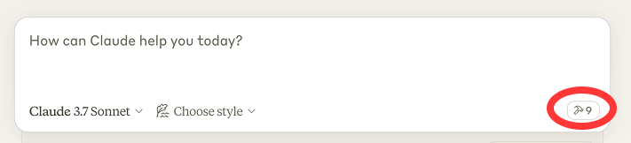

# Altium MCP Server

TLDR: Use Claude to control or ask questions about your Altium project.
This is a Model Context Protocol (MCP) server that provides an interface to interact with Altium Designer through Python. The server allows for querying and manipulation of PCB designs programmatically.

Note: Having Claude place components on the PCB currently fails hard.

## Example commands
- Create a schematic symbol from the attached MPM3650 switching regulator datasheet and make sure to strictly follow the symbol placement rules. (Note: Need to open a schematic library. Uses `C:\AltiumMCP\symbol_placement_rules.txt` description as pin placement rules. Please modify for your own preferences.)
- Duplicate layout for my selected PCB components. (Will prompt user to now select destination components. Only supports component placement)
- Get me all parts on my design made by Molex
- Give me the description and part number of U4
- Place the selected parts on my pcb with best practices for a switching regulator. Note: It tries, but does terrible placement. Hopefully I can find a way to improve this.
- Give me a list of all IC designators in my design
- Get me all length matching rules

## Setup
Currently only tested on Windows & the Altium scripts have hard coded `C:\AltiumMCP` paths for now. That's probably a good TODO item.

1. Ensure the AltiumMCP directory is located at `C:\AltiumMCP\`
2. The Altium script files should be located in `C:\AltiumMCP\AltiumScript\`
3. Install uv

**On Windows**
```bash
powershell -c "irm https://astral.sh/uv/install.ps1 | iex" 
```
and then
```bash
set Path=C:\Users\nntra\.local\bin;%Path%
```

### Claude for Desktop Integration
Enable Developer Mode under Claude > Help > Enable Developer Mode

Go to Claude > Settings > Developer > Edit Config > claude_desktop_config.json to include the following:
Below is specific to Windows, TODO: find out how to run on both without a hard coded path
```json
{
    "mcpServers": {
        "altium": {
            "command": "uv",
            "args": [
                "--directory",
                "C:\\AltiumMCP",
                "run",
                "server.py"
            ]
        }
    }
}
```

### Using with Claude
Restart Cluade: Right click on the Claude icon in the System Tray > Quit. Then re-open Claude desktop. 

Once the config file has been set on Claude, and the addon is running on Altium, you will see a hammer icon with tools for the Altium MCP.



## Configuration

The server will automatically try to locate your Altium Designer installation. If it cannot find it, you will be prompted to select the Altium executable (X2.EXE) manually when you first run the server.

The server checks common installation paths:
- C:\Program Files\Altium\AD19\X2.EXE
- C:\Program Files\Altium\AD20\X2.EXE
- C:\Program Files\Altium\AD21\X2.EXE
- C:\Program Files\Altium\AD22\X2.EXE
- C:\Program Files\Altium\AD23\X2.EXE
- C:\Program Files\Altium\AD24\X2.EXE

If your Altium Designer is installed in a different location, you can select it manually when prompted.

## Available Tools

The server provides several tools to interact with Altium Designer:

### Component Information
- `get_all_designators`: Get a list of all component designators in the current board
- `get_all_component_property_names`: Get a list of all available component property names
- `get_component_property_values`: Get the values of a specific property for all components
- `get_component_data`: Get detailed data for specific components by designator
- `get_component_pins`: Get pin information for specified components

### Schematic/Symbol
- `get_schematic_data`: Get schematic data for specified components
- `get_symbol_placement_rules`: Reads `C:\AltiumMCP\symbol_placement_rules.txt` to get pin placement rules for symbol creation.
- `create_schematic_symbol`: Passes pin list with pin type & coordinates to Altium script

### Layout Operations
- `get_pcb_rules`: Gets the rule descriptions for all pcb rules in layout.
- `get_selected_components_coordinates`: Get position and rotation information for currently selected components
- `move_components`: Move specified components by X and Y offsets
- `get_pcb_screenshot`: Take a screenshot of the Altium PCB window
- `layout_duplicator`: Starts layout duplication assuming you have already selected the source components on the PCB.
- `layout_duplicator_apply`: Action #2 of `layout_duplicator`. Agent will use part info automatically to predict the match between source and destination components, then will send those matches to the place script.

### Server Status
- `get_server_status`: Check the status of the MCP server, including paths to Altium and script files

## How It Works

The server communicates with Altium Designer using a scripting bridge:

1. It writes command requests to `C:\AltiumMCP\request.json`
2. It launches Altium with instructions to run the `Altium_API.PrjScr` script
3. The script processes the request and writes results to `C:\AltiumMCP\response.json`
4. The server reads and returns the response

## Running with Claude Desktop

## References
- BlenderMCP: I got inspired by hearing about MCP being used in Blender and used it as a reference. https://github.com/ahujasid/blender-mcp
- Claude: I vibe coded most of this with Claude 3.7
- Claude is not familiar with DelphiScript, so many of the Altium provided example scripts were used as reference.

## Disclaimer
This is a third-party integration and not made by Altium. Made by [coffeenmusic](https://x.com/coffeenmusic)

# TODO:
- Add get schematic & pcb library path for footprint. 
- Add get symbol from library
- Add rotation to move function
- log response time of each tool
- Add go to schematic sheet
- Show layers: IPCB_Board.VisibleLayers
	+ AutoSilk.pas
- Go to sheet with component designator
- Get screenshot of schematic
- Board.ChooseLocation(x, y, 'Test');
- Zoom to selected objects: