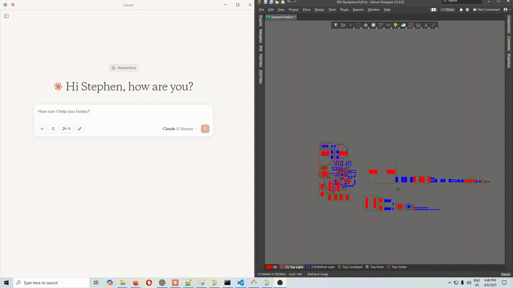

# Altium MCP Server

TLDR: Use Claude to control or ask questions about your Altium project.
This is a Model Context Protocol (MCP) server that provides an interface to interact with Altium Designer through Python. The server allows for querying and manipulation of PCB designs programmatically.

Note: Having Claude place components on the PCB currently fails hard.

## Example commands
- Run all output jobs
- Create a symbol for the part in the attached datasheet and use the currently open symbol as a reference example.
- Create a schematic symbol from the attached MPM3650 switching regulator datasheet and make sure to strictly follow the symbol placement rules. (Note: Need to open a schematic library. Uses `C:\AltiumMCP\symbol_placement_rules.txt` description as pin placement rules. Please modify for your own preferences.)
- Duplicate my selected layout. (Will prompt user to now select destination components. Supports Component, Track, Arc, Via, Polygon, & Region)
- Show all my inner layers. Show the top and bottom layer. Turn off solder paste.
- Get me all parts on my design made by Molex
- Give me the description and part number of U4
- Place the selected parts on my pcb with best practices for a switching regulator. Note: It tries, but does terrible placement. Hopefully I can find a way to improve this.
- Give me a list of all IC designators in my design
- Get me all length matching rules

## Installing the MCP Server
1. Download the `altium-mcp.dxt` desktop extension file
2. In Claude Desktop on Windows: `drop down > File > Settings > Extensions > Advanced > Install Extension...` Select the .dxt file

You shouldn't need to restart Claude and you should now see altium-mcp in the tool menu near the search bar.


## Creating a new .dxt (For Developers)
### uv server/venv (Recommended)
**On Windows**

1. 
```bash
powershell -c "irm https://astral.sh/uv/install.ps1 | iex" 
```
and then
```bash
set Path=C:\Users\nntra\.local\bin;%Path%
```

2. Create the venv directory where DXT expects: from the root directory run `uv venv server/venv`
3. Install dependencies to venv: `uv pip install --python server/venv/Scripts/python.exe -r requirements.txt`
4. Update the manifest for `server/venv` and include any new tools that have been added, bump the revisions, etc.
```
  "server": {
    "type": "python",
    "entry_point": "server/main.py",
    "mcp_config": {
      "command": "${__dirname}/server/venv/Scripts/python.exe",
      "args": ["${__dirname}/server/main.py"],
	  "env": {
		"PYTHONPATH": "${__dirname}/server/venv"
	  }
    }
  }
```
5. Download Node.js, install Anthropic's DXT tool: `npm install -g @anthropic-ai/dxt`, package dxt: `dxt pack`

### pip server/lib (Not Tested)
1. Populate the packages in the `server/lib` directory: from root dir > `pip install -r requirements.txt -t server/lib`
2. Update the manifest for `server/lib` and include any new tools that have been added, bump the revisions, etc.
```
"server": {
    "type": "python",
    "entry_point": "server/main.py",
    "mcp_config": {
      "command": "python",
      "args": [
	    "${__dirname}/server/main.py",
		"--workspace=${user_config.workspace_directory}"		
		],
	  "env": {
		"PYTHONPATH": "${__dirname}/server/lib"
	  }
    }
  }
```
3. Download Node.js, install Anthropic's DXT tool: `npm install -g @anthropic-ai/dxt`, package dxt: `dxt pack`

### DXT Resources
- [Desktop Extensions](https://www.anthropic.com/engineering/desktop-extensions)
- [Desktop Extensions Github](https://github.com/anthropics/dxt)
- [Getting Started with DXT](https://support.anthropic.com/en/articles/10949351-getting-started-with-local-mcp-servers-on-claude-desktop)
- [Python DXT Example Code](https://github.com/anthropics/dxt/tree/main/examples/file-manager-python)
- [DXT Manifest](https://github.com/anthropics/dxt/blob/main/MANIFEST.md)


## Configuration

When launching claude for the first time, the server will automatically try to locate your Altium Designer installation. It will search for all directories that start with `C:\Program Files\Altium\AD*` and use the one with the largest revision number. If it cannot find any, you will be prompted to select the Altium executable (X2.EXE) manually when you first run the server. Altium's DelphiScript scripting is used to create an API between the mcp server and Altium. 

## Available Tools

The server provides several tools to interact with Altium Designer:

### Output Jobs
- `get_output_job_containers`: Using currently open .OutJob file, reads all available output containers
- `run_output_jobs`: Pass a list of output job container names from the currently open .OutJob to run any number of them. `.OutJob` must be the currently focused document.

### Component Information
- `get_all_designators`: Get a list of all component designators in the current board
- `get_all_component_property_names`: Get a list of all available component property names
- `get_component_property_values`: Get the values of a specific property for all components
- `get_component_data`: Get detailed data for specific components by designator
- `get_component_pins`: Get pin information for specified components

### Schematic/Symbol
- `get_schematic_data`: Get schematic data for specified components
- `create_schematic_symbol` ([YouTube](https://youtu.be/MMP7ZfmbCMI)): Passes pin list with pin type & coordinates to Altium script
- `get_symbol_placement_rules`: Create symbol's helper tool that reads `C:\AltiumMCP\symbol_placement_rules.txt` to get pin placement rules for symbol creation.
- `get_library_symbol_reference`: Create symbol's helper tool to use an open library symbol as an example to create the symbol


### Layout Operations
- `get_all_nets`: Returns a list of unique nets from the pcb
- `create_net_class` ([YouTube](https://youtu.be/89booqRbnzQ)): Create a net class from a list of nets
- `get_pcb_layers`: Get detailed layer information including electrical, mechanical, layer pairs, etc.
- `get_pcb_layer_stackup`: Gets stackup info like dielectric, layer thickness, etc.
- `set_pcb_layer_visibility` ([YouTube](https://youtu.be/XaWs5A6-h30)): Turn on or off any group of layers. For example turn on inner layers. Turn off silk.
- `get_pcb_rules`: Gets the rule descriptions for all pcb rules in layout.
- `get_selected_components_coordinates`: Get position and rotation information for currently selected components
- `move_components`: Move specified components by X and Y offsets
- `layout_duplicator` ([YouTube](https://youtu.be/HD-A_8iVV70)): Starts layout duplication assuming you have already selected the source components on the PCB.
- `layout_duplicator_apply`: Action #2 of `layout_duplicator`. Agent will use part info automatically to predict the match between source and destination components, then will send those matches to the place script.

The cool thing about layout duplication this way as opposed to with Altium's built in layout replication, is that the exact components don't have to match because the LLM can look through the descriptions and understand which components match and which don't have a match. That's something that can't really be hard coded.


### Both
- `get_screenshot`: Take a screenshot of the Altium PCB window or Schematic Window that is the current view. It should auto focus either of these if it is open but a different document type is focused. Note: Claude is not very good at analyzing images like circuits or layout screenshots. ChatGPT is very good at it, but they haven't released MCP yet, so this functionality will be more useful in the future.

### Server Status
- `get_server_status`: Check the status of the MCP server, including paths to Altium and script files

## How It Works

The server communicates with Altium Designer using a scripting bridge:

1. It writes command requests to `workspace\request.json`
2. It launches Altium with instructions to run the `Altium_API.PrjScr` script
3. The script processes the request and writes results to `workspace\response.json`
4. The server reads and returns the response

## References
- Get scripts' project path from Jeff Collins and William Kitchen's stripped down version
- BlenderMCP: I got inspired by hearing about MCP being used in Blender and used it as a reference. https://github.com/ahujasid/blender-mcp
- Used CopyDesignatorsToMechLayerPair script by Petar Perisin and Randy Clemmons for reference on how to .Replicate objects (used in layout duplicator)
- Petar Perisin's Select Bad Connections Script: For understanding how to walk pcb primitives (track, arc, via, etc) connected to a pad
- Matija Markovic and Petar Perisin Distribute Script: For understanding how to properly let the GUI know when I've updated tracks' nets
- Petar Perisin's Room from Poly: Used as reference to detect poly to pad overlap since I couldn't get more tradition methods to work.
- Petar Perisin's Layer Panel Script: Used as reference for getting layers and changing layer visibility
- Jeff Collins has an XIA_Release_Manager.pas script that taught me the art of the Output Job. See his post on the Altium Forums: https://forum.live.altium.com/#/posts/189423

## Disclaimer
This is a third-party integration and not made by Altium. Made by [coffeenmusic](https://x.com/coffeenmusic)

# TODO:
- Change selection filter:
  - `scripts-libraries\Scripts - PCB\FilterObjects\`
  - `scripts-libraries\Scripts - SCH\SelectionFilter\`
- Show/Hide Panels: `DXP/ReportPCBViews.pas`
- Create rules: `PCB/CreateRules.pas`
- Run DRC: IPCB_Board.RunBatchDesignRuleCheck( 
- Move cursor to position: IPCB_Board.XCursor, IPCB_Board.YCursor 
- Add get schematic & pcb library path for footprint. 
- Add get symbol from library
- log response time of each tool
- Add go to schematic sheet
- Go to sheet with component designator
- Board.ChooseLocation(x, y, 'Test');
- Zoom to selected objects:
- Change Schematic Selection Filter: SelectionFilter.pas
- Place schematic objects (place component from library): PlaceSchObjects.pas
- How can I read through components from libraries in Components panel?

TODO Tests:
Need to add the following test units
- `get_pcb_layers` 
- `set_pcb_layer_visibility`
- `layout_duplicator`
- `get_pcb_screenshot`
